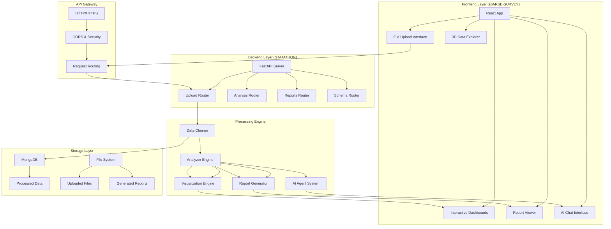
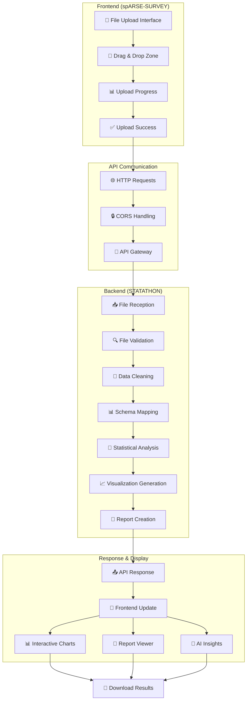
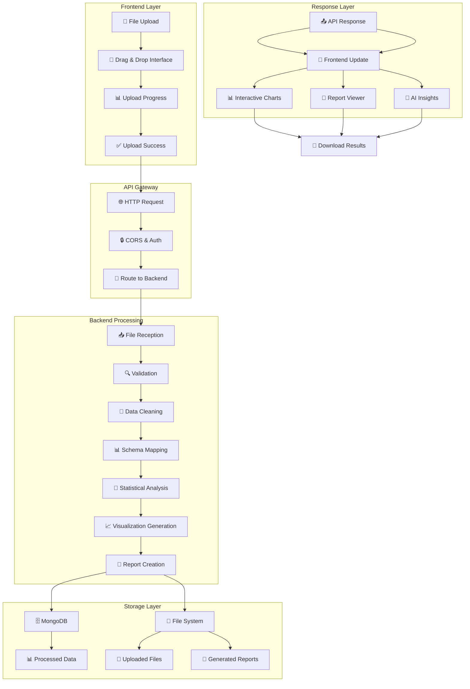

# 🚀 STATATHON + spARSE-SURVEY - Complete Survey Analytics Ecosystem

<div align="center">


**Complete Survey Analytics Ecosystem: Backend Processing + Modern Frontend Interface**

[](https://opensource.org/licenses/MIT)
[](http://makeapullrequest.com)

</div>

---

## 📋 Table of Contents

- [🎯 Project Overview](#-project-overview)
- [🏗️ Architecture Overview](#️-architecture-overview)
- [📊 STATATHON Backend](#-statathon-backend)
- [🎨 spARSE-SURVEY Frontend](#-sparse-survey-frontend)
- [🔗 Integration & Workflow](#-integration--workflow)
- [🚀 Quick Start](#-quick-start)
- [📦 Installation](#-installation)
- [🔧 Configuration](#-configuration)
- [💻 Usage](#-usage)
- [📊 Data Flow](#-data-flow)
- [🔍 API Endpoints](#-api-endpoints)
- [🎨 Frontend Features](#-frontend-features)
- [📈 Analytics Capabilities](#-analytics-capabilities)
- [🎨 Visualization Features](#-visualization-features)
- [📄 Report Generation](#-report-generation)
- [🛠️ Development](#️-development)
- [🧪 Testing](#-testing)
- [📚 Documentation](#-documentation)
- [🤝 Contributing](#-contributing)
- [📄 License](#-license)

---

## 🎯 Project Overview

This repository contains a **complete survey analytics ecosystem** consisting of two integrated projects:

### 🐍 **STATATHON** - Advanced Backend Analytics Engine
A cutting-edge Python-based survey data analytics platform designed to transform raw survey responses into comprehensive, actionable insights. Built with FastAPI, MongoDB, and advanced statistical libraries.

### ⚛️ **spARSE-SURVEY** - Modern Frontend Interface
A sophisticated React-based frontend application providing an intuitive, interactive user interface for data upload, visualization, and report generation. Built with TypeScript, Tailwind CSS, and modern React patterns.

### 🎯 Why This Ecosystem?

- **🔬 Complete Analytics Pipeline**: From data upload to insights delivery
- **🎨 Modern User Experience**: Intuitive, responsive, and accessible interface
- **📊 Rich Visualizations**: Interactive charts, 3D visualizations, and real-time dashboards
- **⚡ High Performance**: Optimized backend processing with modern frontend
- **🔒 Enterprise-Ready**: Scalable architecture with robust error handling
- **🌐 Full-Stack Solution**: Seamless integration between frontend and backend

---

## 🏗️ Architecture Overview



---

## 📊 STATATHON Backend

### 🎯 **Core Purpose**
STATATHON serves as the powerful backend engine that processes, analyzes, and transforms survey data into actionable insights.

### ✨ **Key Features**

#### 📊 **Data Processing & Analysis**
- 🔄 **Automated Data Cleaning**: Intelligent handling of missing values, outliers, and data inconsistencies
- 📈 **Statistical Analysis**: Correlation analysis, trend detection, descriptive statistics
- 🤖 **Machine Learning**: Predictive modeling and pattern recognition
- 📋 **Schema Mapping**: Flexible data structure adaptation

#### 🎨 **Visualization Engine**
- 📊 **Interactive Charts**: Scatter plots, histograms, time series, correlation matrices
- 🌍 **3D Visualizations**: Advanced 3D plotting capabilities
- 🎯 **Custom Styling**: Modern, professional chart aesthetics
- 📱 **Responsive Design**: Mobile-friendly visualizations

#### 📄 **Report Generation**
- 📑 **HTML Reports**: Rich, interactive web-based reports
- 📄 **PDF Reports**: Professional, print-ready documentation
- 🎨 **Custom Templates**: Flexible report customization
- 📊 **Embedded Visualizations**: Charts and graphs integrated into reports

#### 🔧 **Technical Excellence**
- ⚡ **FastAPI Backend**: High-performance REST API
- 🗄️ **MongoDB Integration**: Scalable data storage
- 🔒 **Error Handling**: Robust error management and recovery
- 📝 **Comprehensive Logging**: Detailed operation tracking

### 🛠️ **Technology Stack**
- **🐍 Python 3.8+**: Core programming language
- **⚡ FastAPI**: Modern, fast web framework
- **🗄️ MongoDB**: NoSQL database for data storage
- **📊 Pandas**: Data manipulation and analysis
- **📈 Matplotlib/Seaborn**: Data visualization
- **🔬 NumPy/SciPy**: Scientific computing
- **🤖 Scikit-learn**: Machine learning capabilities
- **📄 ReportLab**: PDF generation
- **🎨 Jinja2**: HTML templating

---

## 🎨 spARSE-SURVEY Frontend

### 🎯 **Core Purpose**
spARSE-SURVEY provides a modern, intuitive user interface that makes complex data analytics accessible to users of all technical levels.

### ✨ **Key Features**

#### 🎨 **Modern User Interface**
- **🎯 Intuitive Design**: Clean, modern interface with excellent UX
- **📱 Responsive Layout**: Works seamlessly on desktop, tablet, and mobile
- **🌙 Dark/Light Mode**: Automatic theme switching with user preferences
- **♿ Accessibility**: WCAG compliant with screen reader support

#### 📊 **Interactive Dashboards**
- **📈 Real-time Charts**: Live data visualization with Recharts
- **🎨 3D Data Explorer**: Three.js powered 3D data visualization
- **🌍 Globe Visualization**: Interactive 3D globe for geographic data
- **📊 Knowledge Graph**: Network visualization for data relationships

#### 🤖 **AI-Powered Features**
- **💬 AI Chat Interface**: Natural language data queries
- **🔍 Auto Insight Engine**: Automatic pattern detection and insights
- **📝 Data Story Mode**: AI-generated narrative reports
- **🎯 Scenario Simulator**: Predictive modeling interface

#### 🎮 **Advanced Interactions**
- **⌨️ Command Palette**: Keyboard-driven navigation
- **🎨 Animated Cursor**: Custom cursor with smooth animations
- **📊 Drag & Drop**: Intuitive file upload interface
- **🎵 Ambient Audio**: Optional background audio for focus

### 🛠️ **Technology Stack**
- **⚛️ React 18**: Modern React with hooks and concurrent features
- **📘 TypeScript**: Type-safe JavaScript development
- **🎨 Tailwind CSS**: Utility-first CSS framework
- **🎭 Framer Motion**: Smooth animations and transitions
- **📊 Recharts**: Interactive chart library
- **🌍 Three.js**: 3D graphics and visualization
- **🎨 Radix UI**: Accessible component primitives
- **📱 React Router**: Client-side routing
- **🔍 React Query**: Server state management
- **🎵 GSAP**: Advanced animations

---

## 🔗 Integration & Workflow

### 🔄 **Complete Data Pipeline**



### 🔗 **Integration Points**

#### **1. File Upload Integration**
- **Frontend**: Drag-and-drop interface with progress tracking
- **Backend**: Multipart file handling with validation
- **Communication**: RESTful API with real-time status updates

#### **2. Data Processing Pipeline**
- **Frontend**: Real-time progress indicators and status updates
- **Backend**: Asynchronous processing with WebSocket updates
- **Communication**: Event-driven architecture for live updates

#### **3. Visualization Integration**
- **Frontend**: Interactive chart rendering with user controls
- **Backend**: Chart generation with embedded data
- **Communication**: JSON data exchange with chart configuration

#### **4. Report Generation**
- **Frontend**: Report preview and download interface
- **Backend**: HTML/PDF generation with embedded visualizations
- **Communication**: File download with progress tracking

### 🔄 **Real-time Features**
- **📊 Live Data Updates**: Real-time chart updates during processing
- **🎯 Progress Tracking**: Visual progress indicators for long operations
- **💬 Status Notifications**: Toast notifications for operation status
- **🔄 Auto-refresh**: Automatic data refresh for live dashboards

---

## 🚀 Quick Start

### Prerequisites

- **Python 3.8+** 🐍
- **Node.js 18+** 📦
- **MongoDB** 🗄️
- **Git** 📦

### 1️⃣ Clone the Repository

```bash
git clone https://github.com/yourusername/survey-analytics-ecosystem.git
cd survey-analytics-ecosystem
```

### 2️⃣ Backend Setup (STATATHON)

```bash
# Navigate to backend
cd STATATHON

# Create virtual environment
python -m venv .venv

# Activate virtual environment
# Windows:
.venv\Scripts\activate
# macOS/Linux:
source .venv/bin/activate

# Install dependencies
pip install -r requirements.txt

# Start MongoDB (if not running)
# Windows:
net start MongoDB
# macOS:
brew services start mongodb-community
# Linux:
sudo systemctl start mongod

# Start backend server
python run_server.py
```

### 3️⃣ Frontend Setup (spARSE-SURVEY)

```bash
# Open new terminal and navigate to frontend
cd sparsh-survey

# Install dependencies
npm install

# Start development server
npm run dev
```

### 4️⃣ Access the Application

- 🌐 **Frontend Interface**: http://localhost:5173
- 📚 **Backend API**: http://127.0.0.1:8000
- 📖 **API Documentation**: http://127.0.0.1:8000/docs

---

## 📦 Installation

### Detailed Installation Guide

#### Step 1: Environment Setup

```bash
# Create project directory
mkdir survey-analytics-ecosystem
cd survey-analytics-ecosystem

# Clone repository
git clone https://github.com/yourusername/survey-analytics-ecosystem.git .

# Create backend virtual environment
cd STATATHON
python -m venv .venv

# Activate backend environment
# Windows:
.venv\Scripts\activate
# macOS/Linux:
source .venv/bin/activate
```

#### Step 2: Backend Dependencies

```bash
# Install Python dependencies
pip install -r requirements.txt

# Verify backend installation
python -c "import pandas, numpy, matplotlib, fastapi; print('✅ Backend dependencies installed!')"
```

#### Step 3: Frontend Dependencies

```bash
# Navigate to frontend
cd ../sparsh-survey

# Install Node.js dependencies
npm install

# Verify frontend installation
npm run build
```

#### Step 4: Database Setup

```bash
# Start MongoDB
# Windows:
net start MongoDB
# macOS:
brew services start mongodb-community
# Linux:
sudo systemctl start mongod

# Verify MongoDB connection
python -c "from pymongo import MongoClient; client = MongoClient('mongodb://localhost:27017/'); print('✅ MongoDB connected!')"
```

#### Step 5: Configuration

```bash
# Backend configuration
cd ../STATATHON
cp .env.example .env
# Edit .env file with your settings

# Frontend configuration (if needed)
cd ../sparsh-survey
# Edit vite.config.ts for custom settings
```

#### Step 6: Test Installation

```bash
# Test backend
cd ../STATATHON
python test_complete.py

# Test frontend
cd ../sparsh-survey
npm run build
```

---

## 🔧 Configuration

### Backend Configuration (STATATHON)

Create a `.env` file in the `STATATHON` directory:

```env
# Database Configuration
MONGODB_URL=mongodb://localhost:27017/
DATABASE_NAME=statathon_db

# File Upload Configuration
UPLOAD_DIR=./uploads
MAX_FILE_SIZE=10485760  # 10MB

# Server Configuration
HOST=127.0.0.1
PORT=8000
DEBUG=True

# CORS Configuration (for frontend integration)
CORS_ORIGINS=["http://localhost:5173", "http://127.0.0.1:5173"]

# Security Configuration
SECRET_KEY=your-secret-key-here
```

### Frontend Configuration (spARSE-SURVEY)

Edit `sparsh-survey/vite.config.ts`:

```typescript
import { defineConfig } from 'vite'
import react from '@vitejs/plugin-react-swc'

export default defineConfig({
  plugins: [react()],
  server: {
    port: 5173,
    proxy: {
      '/api': {
        target: 'http://127.0.0.1:8000',
        changeOrigin: true,
        secure: false,
      }
    }
  },
  build: {
    outDir: 'dist',
    sourcemap: true
  }
})
```

### Configuration Options

| Component | Setting | Description | Default |
|-----------|---------|-------------|---------|
| **Backend** | `MONGODB_URL` | MongoDB connection string | `mongodb://localhost:27017/` |
| **Backend** | `DATABASE_NAME` | Database name | `statathon_db` |
| **Backend** | `UPLOAD_DIR` | File upload directory | `./uploads` |
| **Backend** | `MAX_FILE_SIZE` | Maximum file size (bytes) | `10485760` |
| **Backend** | `HOST` | Server host | `127.0.0.1` |
| **Backend** | `PORT` | Server port | `8000` |
| **Frontend** | `VITE_API_URL` | Backend API URL | `http://127.0.0.1:8000` |
| **Frontend** | `VITE_APP_TITLE` | Application title | `Survey Analytics` |

---

## 💻 Usage

### Starting the Complete System

#### Development Mode

```bash
# Terminal 1: Start Backend
cd STATATHON
source .venv/bin/activate  # or .venv\Scripts\activate on Windows
python run_server.py

# Terminal 2: Start Frontend
cd sparsh-survey
npm run dev
```

#### Production Mode

```bash
# Build frontend
cd sparsh-survey
npm run build

# Start backend with production settings
cd ../STATATHON
uvicorn app.main:app --host 0.0.0.0 --port 8000 --workers 4
```

### Using the Application

#### 1. **Data Upload**
- Navigate to http://localhost:5173
- Use the drag-and-drop interface to upload CSV/Excel files
- Monitor real-time upload progress
- View file validation results

#### 2. **Data Processing**
- Watch real-time processing progress
- View data cleaning results
- Monitor statistical analysis progress
- See visualization generation in real-time

#### 3. **Interactive Analysis**
- Explore interactive charts and visualizations
- Use 3D data explorer for spatial data
- Generate AI-powered insights
- Create custom dashboards

#### 4. **Report Generation**
- Generate HTML reports with embedded visualizations
- Create PDF reports for sharing
- Download data exports
- Share insights via AI chat interface

### API Usage

#### Upload Data

```bash
# Using curl
curl -X POST "http://127.0.0.1:8000/api/upload" \
  -H "Content-Type: multipart/form-data" \
  -F "file=@your_survey_data.csv"

# Using JavaScript (Frontend)
const formData = new FormData();
formData.append('file', fileInput.files[0]);

const response = await fetch('http://127.0.0.1:8000/api/upload', {
  method: 'POST',
  body: formData
});
```

#### Generate Reports

```bash
# Generate HTML report
curl -X POST "http://127.0.0.1:8000/api/reports/html" \
  -H "Content-Type: application/json" \
  -d '{"dataset_id": "your_dataset_id"}'

# Generate PDF report
curl -X POST "http://127.0.0.1:8000/api/reports/pdf" \
  -H "Content-Type: application/json" \
  -d '{"dataset_id": "your_dataset_id"}'
```

---

## 📊 Data Flow



---

## 🔍 API Endpoints

### Upload Endpoints

| Method | Endpoint | Description |
|--------|----------|-------------|
| `POST` | `/api/upload` | Upload survey data file |
| `GET` | `/api/upload/{file_id}` | Get file information |
| `DELETE` | `/api/upload/{file_id}` | Delete uploaded file |

### Analysis Endpoints

| Method | Endpoint | Description |
|--------|----------|-------------|
| `POST` | `/api/analyze/clean` | Clean uploaded data |
| `POST` | `/api/analyze/statistics` | Generate statistical analysis |
| `POST` | `/api/analyze/correlation` | Perform correlation analysis |
| `POST` | `/api/analyze/visualizations` | Create data visualizations |

### Report Endpoints

| Method | Endpoint | Description |
|--------|----------|-------------|
| `POST` | `/api/reports/html` | Generate HTML report |
| `POST` | `/api/reports/pdf` | Generate PDF report |
| `GET` | `/api/reports/{report_id}` | Download generated report |

### Schema Endpoints

| Method | Endpoint | Description |
|--------|----------|-------------|
| `POST` | `/api/schema/map` | Map data schema |
| `GET` | `/api/schema/templates` | Get schema templates |
| `PUT` | `/api/schema/update` | Update schema mapping |

---

## 🎨 Frontend Features

### 🎯 **User Interface Components**

#### **Navigation & Layout**
- **⌨️ Command Palette**: Keyboard-driven navigation with search
- **🧭 Breadcrumb Trail**: Clear navigation path
- **🎨 Animated Cursor**: Custom cursor with smooth animations
- **🌙 Theme Toggle**: Dark/light mode switching
- **⚙️ Settings Panel**: User preferences and configuration

#### **Data Upload Interface**
- **📁 Drag & Drop**: Intuitive file upload with visual feedback
- **📊 Progress Tracking**: Real-time upload progress indicators
- **✅ Validation Feedback**: Immediate file validation results
- **🔄 Retry Mechanism**: Automatic retry for failed uploads

#### **Interactive Dashboards**
- **📈 Real-time Charts**: Live data visualization with Recharts
- **🎨 3D Data Explorer**: Three.js powered 3D visualizations
- **🌍 Globe Visualization**: Interactive 3D globe for geographic data
- **📊 Knowledge Graph**: Network visualization for data relationships

### 🤖 **AI-Powered Features**

#### **Intelligent Analysis**
- **💬 AI Chat Interface**: Natural language data queries
- **🔍 Auto Insight Engine**: Automatic pattern detection
- **📝 Data Story Mode**: AI-generated narrative reports
- **🎯 Scenario Simulator**: Predictive modeling interface

#### **Smart Recommendations**
- **📊 Chart Suggestions**: AI-recommended visualizations
- **🔍 Pattern Detection**: Automatic anomaly and trend detection
- **📈 Insight Generation**: AI-powered data insights
- **🎨 Layout Optimization**: Smart dashboard layouts

### 🎮 **Advanced Interactions**

#### **Enhanced User Experience**
- **🎵 Ambient Audio**: Optional background audio for focus
- **🎭 Smooth Animations**: Framer Motion powered transitions
- **📱 Mobile Responsive**: Optimized for all device sizes
- **♿ Accessibility**: WCAG compliant with screen reader support

#### **Performance Features**
- **⚡ Lazy Loading**: On-demand component loading
- **🔄 Virtual Scrolling**: Efficient large dataset handling
- **💾 Caching**: Smart data caching for performance
- **🎯 Code Splitting**: Optimized bundle sizes

---

## 📈 Analytics Capabilities

### Statistical Analysis

- **📊 Descriptive Statistics**: Mean, median, mode, standard deviation
- **📈 Correlation Analysis**: Pearson, Spearman, Kendall correlations
- **🎯 Trend Analysis**: Linear and polynomial regression
- **📊 Distribution Analysis**: Histograms, box plots, Q-Q plots
- **🔍 Outlier Detection**: Statistical outlier identification
- **📋 Missing Data Analysis**: Pattern and impact assessment

### Machine Learning Features

- **🤖 Predictive Modeling**: Linear regression, classification
- **🎯 Pattern Recognition**: Clustering and segmentation
- **📊 Dimensionality Reduction**: PCA, feature selection
- **🔮 Time Series Analysis**: Forecasting and trend prediction

### Data Quality Assessment

- **✅ Data Validation**: Format and consistency checks
- **🧹 Data Cleaning**: Automated correction and standardization
- **📊 Quality Metrics**: Completeness, accuracy, consistency scores
- **🔍 Anomaly Detection**: Statistical and ML-based detection

---

## 🎨 Visualization Features

### Chart Types

- **📊 Scatter Plots**: Correlation and relationship visualization
- **📈 Line Charts**: Time series and trend analysis
- **📊 Bar Charts**: Categorical data comparison
- **📊 Histograms**: Distribution analysis
- **🌡️ Heatmaps**: Correlation matrices and data patterns
- **📊 Box Plots**: Statistical distribution overview
- **🎯 Violin Plots**: Density and distribution comparison
- **🌍 3D Plots**: Multi-dimensional data visualization

### Interactive Features

- **🔍 Zoom & Pan**: Detailed data exploration
- **📊 Tooltips**: Data point information
- **🎨 Custom Styling**: Color schemes and themes
- **📱 Responsive Design**: Mobile-friendly interfaces
- **💾 Export Options**: PNG, SVG, PDF formats

### 3D Visualizations

- **🌍 Globe Explorer**: Geographic data visualization
- **📊 3D Scatter Plots**: Multi-dimensional data exploration
- **🎯 3D Networks**: Relationship mapping in 3D space
- **📈 3D Time Series**: Temporal data in 3D space

---

## 📄 Report Generation

### HTML Reports

- **🎨 Modern Design**: Professional, responsive layout
- **📊 Interactive Charts**: Embedded visualizations
- **📋 Executive Summary**: Key findings and insights
- **📈 Detailed Analysis**: Comprehensive statistical results
- **📊 Data Tables**: Formatted data presentation
- **🔍 Methodology**: Analysis approach documentation

### PDF Reports

- **📄 Print-Ready**: High-quality document formatting
- **📊 Embedded Visualizations**: Charts and graphs
- **📋 Table of Contents**: Navigation and structure
- **📈 Appendices**: Detailed data and methodology
- **🎨 Professional Styling**: Corporate-ready appearance
- **📊 Multi-Page Layout**: Comprehensive documentation

### AI-Generated Reports

- **📝 Natural Language**: Human-readable insights
- **🎯 Key Findings**: Automatic highlight of important patterns
- **📊 Smart Summaries**: AI-powered executive summaries
- **🔍 Contextual Analysis**: Domain-specific insights

---

## 🛠️ Development

### Project Structure

```
survey-analytics-ecosystem/
├── 📁 STATATHON/                    # Backend Python Application
│   ├── 📁 app/
│   │   ├── 📁 routers/              # API route handlers
│   │   ├── 📁 utils/                # Utility functions
│   │   ├── 📁 templates/            # HTML templates
│   │   ├── 📄 main.py              # FastAPI application
│   │   ├── 📄 config.py            # Configuration settings
│   │   ├── 📄 models.py            # Data models
│   │   └── 📄 schemas.py           # Pydantic schemas
│   ├── 📁 uploads/                 # File upload directory
│   ├── 📁 tests/                   # Test files
│   ├── 📄 requirements.txt         # Python dependencies
│   └── 📄 run_server.py           # Server startup script
├── 📁 sparsh-survey/               # Frontend React Application
│   ├── 📁 src/
│   │   ├── 📁 components/          # React components
│   │   ├── 📁 pages/               # Page components
│   │   ├── 📁 hooks/               # Custom React hooks
│   │   ├── 📁 contexts/            # React contexts
│   │   ├── 📁 lib/                 # Utility functions
│   │   └── 📄 App.tsx             # Main application
│   ├── 📁 public/                  # Static assets
│   ├── 📄 package.json            # Node.js dependencies
│   └── 📄 vite.config.ts          # Vite configuration
└── 📄 README.md                   # This file
```

### Development Setup

```bash
# Clone repository
git clone https://github.com/yourusername/survey-analytics-ecosystem.git
cd survey-analytics-ecosystem

# Backend setup
cd STATATHON
python -m venv .venv
source .venv/bin/activate  # or .venv\Scripts\activate on Windows
pip install -r requirements.txt

# Frontend setup
cd ../sparsh-survey
npm install

# Install development tools
npm install -D @types/node typescript eslint prettier

# Install pre-commit hooks
pre-commit install

# Start development servers
# Terminal 1 (Backend):
cd ../STATATHON
python run_server.py

# Terminal 2 (Frontend):
cd ../sparsh-survey
npm run dev
```

### Code Style

#### Backend (Python)
- **🐍 Python**: Follow PEP 8 guidelines
- **📝 Documentation**: Use docstrings and type hints
- **🧪 Testing**: Maintain >90% test coverage
- **🔍 Linting**: Use flake8 and black for formatting
- **📊 Type Checking**: Use mypy for static type checking

#### Frontend (TypeScript/React)
- **📘 TypeScript**: Strict type checking enabled
- **⚛️ React**: Follow React best practices and hooks
- **🎨 Styling**: Use Tailwind CSS with consistent patterns
- **🧪 Testing**: Jest and React Testing Library
- **🔍 Linting**: ESLint with TypeScript rules
- **🎨 Formatting**: Prettier for consistent code style

---

## 🧪 Testing

### Backend Testing

```bash
# Navigate to backend
cd STATATHON

# Run all tests
pytest

# Run with coverage
pytest --cov=app

# Run specific test file
pytest tests/test_analyzer.py

# Run with verbose output
pytest -v

# Run integration tests
pytest tests/integration/
```

### Frontend Testing

```bash
# Navigate to frontend
cd sparsh-survey

# Run unit tests
npm test

# Run with coverage
npm test -- --coverage

# Run specific test file
npm test -- --testPathPattern=components/FileUpload

# Run integration tests
npm run test:integration
```

### End-to-End Testing

```bash
# Install Playwright
npm install -D @playwright/test

# Run E2E tests
npx playwright test

# Run with UI
npx playwright test --ui
```

### Test Structure

```
tests/
├── 📁 backend/                     # Backend tests
│   ├── 📁 unit/                   # Unit tests
│   ├── 📁 integration/            # Integration tests
│   └── 📁 fixtures/               # Test data
├── 📁 frontend/                   # Frontend tests
│   ├── 📁 unit/                   # Component tests
│   ├── 📁 integration/            # Integration tests
│   └── 📁 e2e/                    # End-to-end tests
└── 📄 conftest.py                # Pytest configuration
```

---

## 📚 Documentation

### API Documentation

- **📖 Interactive Docs**: http://127.0.0.1:8000/docs
- **📋 ReDoc**: http://127.0.0.1:8000/redoc
- **📄 OpenAPI Schema**: http://127.0.0.1:8000/openapi.json

### Component Documentation

- **📖 Storybook**: http://localhost:6006 (if configured)
- **📋 Component Library**: Built-in component documentation
- **🎨 Design System**: Tailwind CSS design tokens

### Additional Resources

- **📖 User Guide**: [docs/user-guide.md](docs/user-guide.md)
- **🔧 API Reference**: [docs/api-reference.md](docs/api-reference.md)
- **📊 Analytics Guide**: [docs/analytics-guide.md](docs/analytics-guide.md)
- **🎨 Frontend Guide**: [docs/frontend-guide.md](docs/frontend-guide.md)
- **🔗 Integration Guide**: [docs/integration-guide.md](docs/integration-guide.md)

---

## 🤝 Contributing

We welcome contributions to both the backend and frontend components! Please see our [Contributing Guidelines](CONTRIBUTING.md) for details.

### How to Contribute

1. **🔀 Fork the repository**
2. **🌿 Create a feature branch**: `git checkout -b feature/amazing-feature`
3. **💾 Commit your changes**: `git commit -m 'Add amazing feature'`
4. **📤 Push to the branch**: `git push origin feature/amazing-feature`
5. **🔀 Open a Pull Request**

### Development Guidelines

#### Backend Contributions
- **📝 Write clear commit messages**
- **🧪 Add tests for new features**
- **📚 Update API documentation**
- **🔍 Follow Python style guidelines**
- **✅ Ensure all tests pass**

#### Frontend Contributions
- **📝 Write clear commit messages**
- **🧪 Add component tests**
- **📚 Update component documentation**
- **🎨 Follow design system guidelines**
- **✅ Ensure responsive design**

#### Integration Contributions
- **🔗 Test API integration**
- **📊 Verify data flow**
- **🎨 Ensure UI consistency**
- **⚡ Optimize performance**

---

## 📄 License

This project is licensed under the MIT License - see the [LICENSE](LICENSE) file for details.

---

## 🙏 Acknowledgments

### Backend Technologies
- **📊 Pandas**: Data manipulation and analysis
- **📈 Matplotlib**: Data visualization
- **⚡ FastAPI**: Modern web framework
- **🗄️ MongoDB**: NoSQL database
- **🔬 NumPy**: Numerical computing
- **📊 SciPy**: Scientific computing

### Frontend Technologies
- **⚛️ React**: User interface library
- **📘 TypeScript**: Type-safe JavaScript
- **🎨 Tailwind CSS**: Utility-first CSS framework
- **🎭 Framer Motion**: Animation library
- **📊 Recharts**: Chart library
- **🌍 Three.js**: 3D graphics library

### Development Tools
- **📦 Vite**: Build tool and dev server
- **🔍 ESLint**: Code linting
- **🎨 Prettier**: Code formatting
- **🧪 Jest**: Testing framework
- **📚 Storybook**: Component documentation

---

<div align="center">

**Made with ❤️ by the Survey Analytics Team**

[](https://github.com/yourusername/survey-analytics-ecosystem/stargazers)
[](https://github.com/yourusername/survey-analytics-ecosystem/network)
[](https://github.com/yourusername/survey-analytics-ecosystem/issues)
[](https://github.com/yourusername/survey-analytics-ecosystem/pulls)

**🌟 Star this repository if you find it helpful!**

</div>
